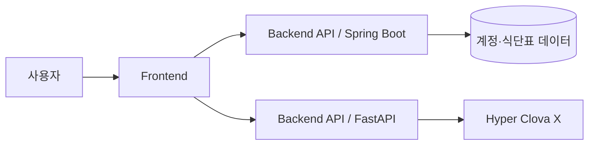

# 냉장고 재료 기반 레시피 & 식단 추천 웹 서비스
사용자가 보유한 식재료를 입력하면 즉시 만들 수 있는 요리를 추천하고, 개인 목표(다이어트/벌크업/유지 등)에 맞는 **주간·월간 식단표**를 자동 생성/관리하는 웹 서비스입니다.

## ✨ 핵심 기능

- **재료 기반 즉시 레시피 추천**  
  - 텍스트/태그로 남은 식재료 입력 → 가능한 레시피 Top-N 추천  
  - 대체 재료 제안, 난이도/조리시간/칼로리 필터
- **목표 맞춤 식단 생성**  
  - (예: 감량/증량/유지) 목표 설정 → 주간/월간 식단표 자동 생성  
  - 알레르기/금기 식재료 제외 규칙

---

## 🧱 아키텍처 개요




* 프론트엔드: SPA/SSR 기반 프론트앤드
* 백엔드: Spring Boot, FastAPI
* 데이터: RDBMS PostgreSQL

---

## 📁 폴더 구조

```
.
├─ interface/        # 화면 설계, UI 명세, API 인터페이스 문서
├─ meeting/          # 회의록, 의사결정 로그(킥오프/스프린트/회고)
├─ output/           # 산출물(보고서, 데모 자료, 배포 산출물)
└─ README.md
```

---

## 👥 팀 구성 & 역할

* **Frontend — 박정은**: 화면 설계, 컴포넌트, 상태관리, 접근성/반응형
* **Backend — 박찬희**: API, 도메인/데이터 모델, 인증/인가
* **Infra — 강준성**: CI/CD, 배포환경, 보안/네트워크, API
